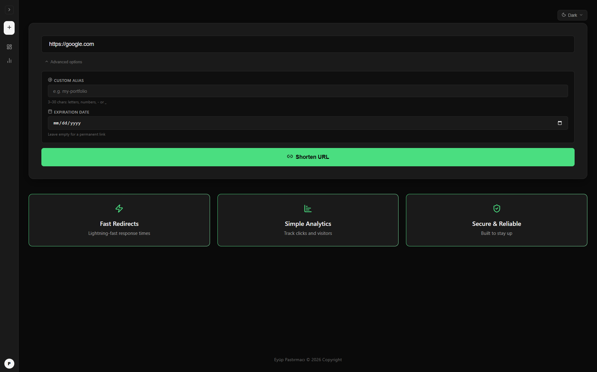
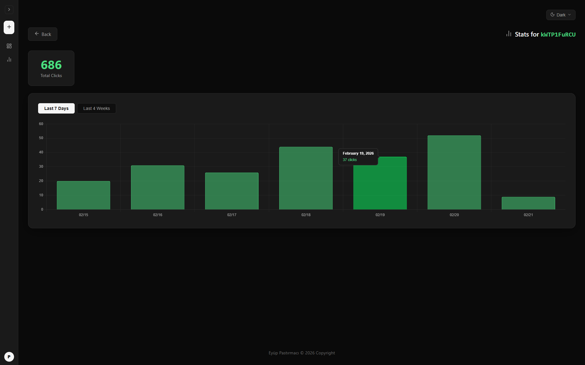
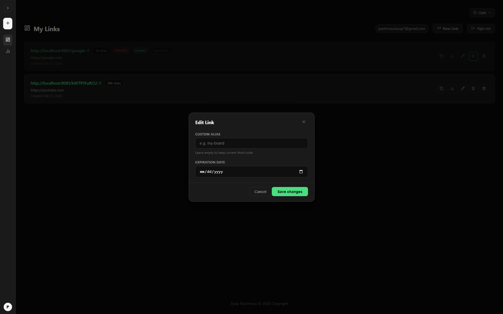
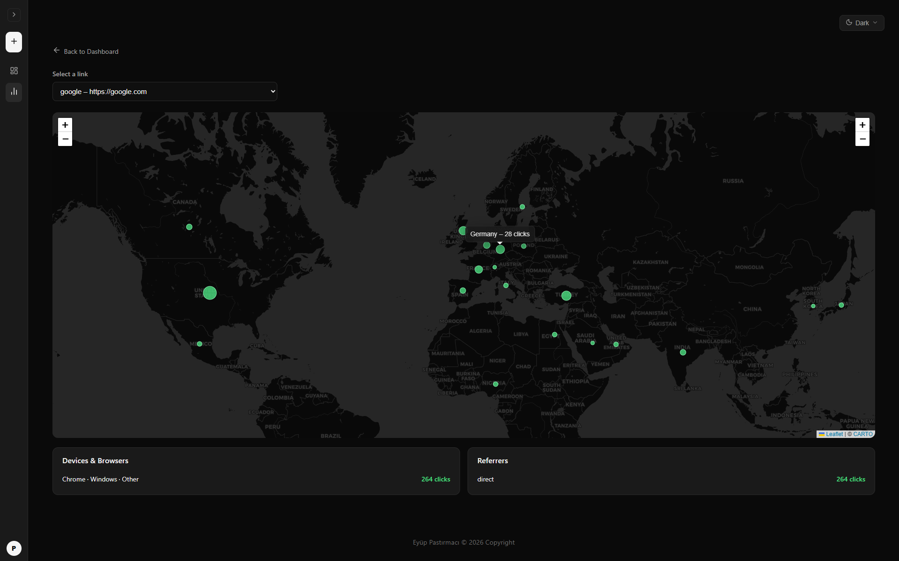

<h1 align="center">Shriven</h1>

<p align="center">
  A simple, distributed URL shortener built with Kotlin and Angular.<br>
  It uses Snowflake IDs and Base62 for generating links.<br>
  The focus is on speed: Redis handles the redirects, while Kafka processes analytics asynchronously.
</p>

<p align="center">
  <a href="LICENSE">
    
  </a>
</p>

<p align="center">
  
  
  
  
  
  
</p>






## Architecture Highlights

- **Snowflake IDs** for distributed, collision-free ID generation
- **Base62 encoding** for compact short codes
- **Redis cache-aside** pattern for ultra-low latency redirects (P99 < 50ms)
- **Event-driven analytics** via Kafka (no DB writes on redirect path)
- **Horizontal scalability** with stateless design

## Features

- 🆔 **Snowflake + Base62 Short Codes** Unique, sortable, collision-free IDs encoded into compact URLs.
- ⚡ **Redis-Backed Redirects** Cache-Aside pattern delivers sub-50ms P99 latency.
- 📨 **Async Analytics via Kafka** Click events are published and batch-processed without blocking redirects.
- 📊 **Click Statistics** Daily and weekly analytics for every short link.
- 🔐 **JWT Authentication** User registration, login, and link ownership.
- ✏️ **Custom Aliases** Vanity URLs like `/my-link` with availability check.
- ⏰ **Link Expiration** Optional expiration date for temporary links.
- 🏷️ **Tags & Organization** Categorize links with tags and filter by tag on the dashboard.
- ✏️ **Link Management** Edit alias and expiration, pause/resume, or delete your links (owner-only).
- 🔗 **Duplicate Detection** Warns when you already have a short link for the same URL.
- 🌍 **GeoIP & Device Tracking** Location, browser, and referrer analytics (country via [ip-api.com](https://ip-api.com); no sign-up or database file required).
- 🐳 **Dockerized Infrastructure** One command spins up PostgreSQL, Redis, and Kafka (KRaft).

## Planned Features
- 📷 **QR Codes** Downloadable QR for every short link.
- 🛡️ **Rate Limiting** IP-based throttling to prevent abuse.
- 🔒 **Password-Protected Links** Restrict access to specific URLs.
- 🤖 **Auto-tagging** Suggests tags from link metadata (title, description) and maps to your tag system.
- 🔗 **Semantic duplicate detection** Warn when a new URL is very similar to an existing short link (same site, similar path).
- ✏️ **Smart alias suggestion** Suggests a readable short alias from the destination URL (e.g. domain + topic).
- 🔍 **Semantic search** Find links by meaning (e.g. "project docs", "payment links") using embeddings and vector search.

## Getting Started

### 1. Start Infrastructure

```bash
docker compose up -d
```

### 2. Configure Backend

Copy the example config and fill in your values:

```bash
cd shriven-backend/src/main/resources
cp application-local.yml.example application-local.yml
```

Open `application-local.yml` and update the following variables:

| Variable | Description |
|----------|-------------|
| `spring.datasource.username` | PostgreSQL username |
| `spring.datasource.password` | PostgreSQL password |
| `jwt.secret` | Base64-encoded 256-bit secret key for JWT signing |

### 3. Run

```bash
# Backend
cd shriven-backend
./gradlew bootRun

# Frontend
cd shriven-frontend
npm install
ng serve
```

## Running Tests

```bash
cd shriven-backend

# Run all tests (uses cached results when nothing changed)
./gradlew test

# Force re-run all tests (ignores cache)
./gradlew test --rerun
```
